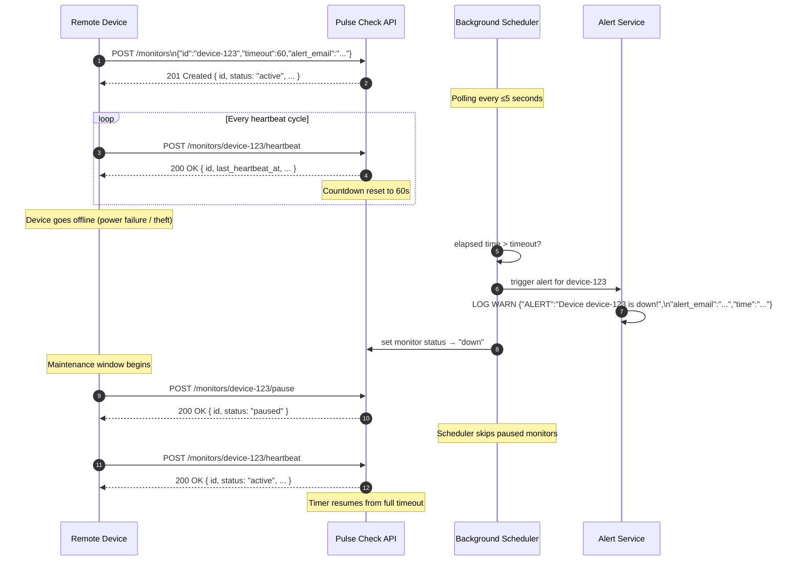
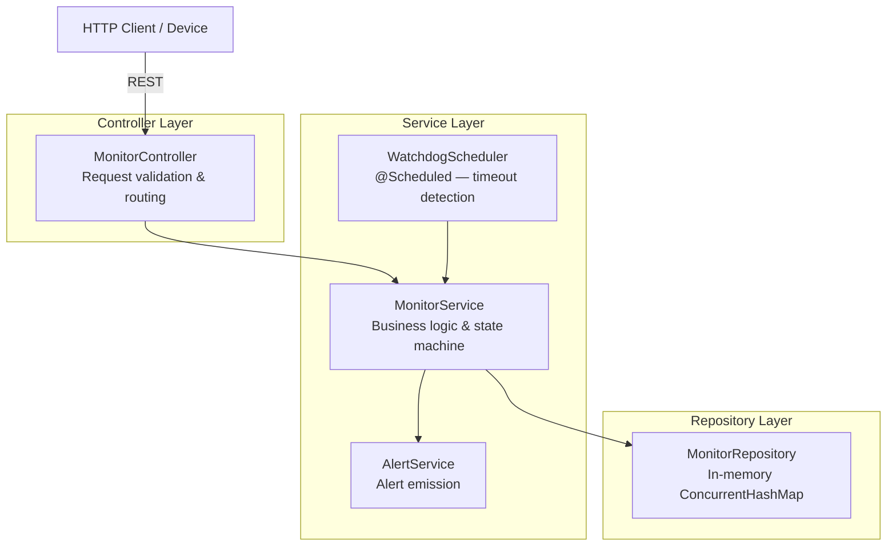
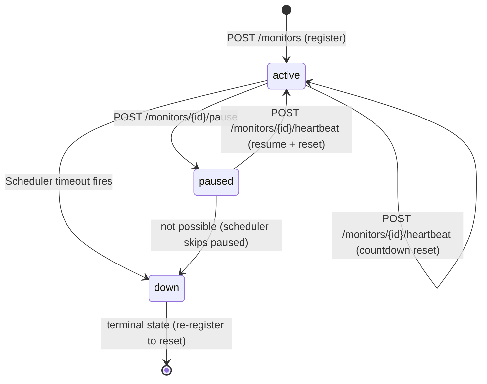

# Pulse Check API — Watchdog Sentinel

A **Dead Man's Switch API** built for **CritMon Servers Inc.** to monitor remote, unmanned infrastructure devices (solar farms, weather stations) operating in poor-connectivity environments.

Devices register a monitor with a configurable timeout. If a heartbeat is not received before the countdown expires, the system automatically fires an alert and marks the device as **down** — no human log-checking required.

**Stack:** Java 17 · Spring Boot 4 · Docker · Layered Architecture (Controller → Service → Repository)

---

## Table of Contents

1. [Architecture](#architecture)
2. [Monitor Lifecycle](#monitor-lifecycle)
3. [Setup — Running Locally](#setup--running-locally)
4. [Setup — Running with Docker](#setup--running-with-docker)
5. [API Reference](#api-reference)
6. [Developer's Choice Feature](#developers-choice-feature)
7. [Environment Variables](#environment-variables)

---

## Architecture

### How the system works — Sequence Diagram



### Layer Diagram



---

## Monitor Lifecycle



| Transition | Trigger | Result |
|---|---|---|
| `[*] → active` | `POST /monitors` | Monitor created, countdown starts |
| `active → active` | `POST /monitors/{id}/heartbeat` | Countdown reset to full timeout |
| `active → paused` | `POST /monitors/{id}/pause` | Countdown frozen, no alerts fire |
| `active → down` | Scheduler timeout | Alert logged, monitor marked down |
| `paused → active` | `POST /monitors/{id}/heartbeat` | Countdown reset, monitoring resumes |

---

## Setup — Running Locally

### Prerequisites

- Java 17+
- Maven 3.8+

### Steps

```bash
# 1. Clone the repository
git clone https://github.com/Suajay/Pulse-Check-API.git
cd Pulse-Check-API

# 2. Build and run (Linux/Mac)
./mvnw spring-boot:run

# 2. Build and run (Windows)
mvnw.cmd spring-boot:run
```

The API will be available at `http://localhost:8080`.

Verify it's running:

```bash
curl http://localhost:8080/actuator/health
# {"status":"UP"}
```

---

## Setup — Running with Docker

### Prerequisites

- Docker Desktop (or Docker Engine)

### Build and Run

```bash
# 1. Build the Docker image
docker build -t pulse-check-api .

# 2. Run the container
docker run -p 8080:8080 pulse-check-api
```

The API will be available at `http://localhost:8080`.

### Custom port

```bash
docker run -p 9090:9090 -e SERVER_PORT=9090 pulse-check-api
```

### Override alert email in logs

```bash
docker run -p 8080:8080 -e ALERT_EMAIL_OVERRIDE=oncall@critmon.com pulse-check-api
```

---

## API Reference

All request bodies must be `Content-Type: application/json`.  
All responses are `Content-Type: application/json`.

### Error Response Format

Every error response follows this consistent structure:

```json
{
  "error": "machine_readable_error_code",
  "message": "Human-readable description of what went wrong."
}
```

---

### POST /monitors — Register a Monitor

Creates a new monitor and starts its countdown timer.

**Request Body**

| Field | Type | Required | Description |
|---|---|---|---|
| `id` | string | Yes | Unique device identifier (non-blank) |
| `timeout` | integer | Yes | Countdown duration in seconds (1–86400) |
| `alert_email` | string | Yes | Email address to include in alert logs |

**Example Request**

```bash
curl -X POST http://localhost:8080/monitors \
  -H "Content-Type: application/json" \
  -d '{
    "id": "device-123",
    "timeout": 60,
    "alert_email": "admin@critmon.com"
  }'
```

**Example Response — 201 Created**

```json
{
  "id": "device-123",
  "timeout": 60,
  "alert_email": "admin@critmon.com",
  "status": "active",
  "created_at": "2025-06-01T12:00:00Z",
  "last_heartbeat_at": null,
  "seconds_remaining": 60
}
```

**Error Responses**

| Status | `error` | Cause |
|---|---|---|
| `400` | `validation_error` | Missing/blank `id`, invalid `timeout`, malformed email |
| `409` | `monitor_already_exists` | A monitor with that `id` is already registered |

---

### POST /monitors/{id}/heartbeat — Send a Heartbeat

Resets the countdown for an active monitor. Also resumes a paused monitor.

**Path Parameters**

| Parameter | Description |
|---|---|
| `id` | The device ID of the monitor |

**Example Request**

```bash
curl -X POST http://localhost:8080/monitors/device-123/heartbeat
```

**Example Response — 200 OK (active monitor)**

```json
{
  "id": "device-123",
  "status": "active",
  "last_heartbeat_at": "2025-06-01T12:00:45Z",
  "seconds_remaining": 60
}
```

**Example Response — 200 OK (paused monitor, auto-resumed)**

```json
{
  "id": "device-123",
  "status": "active",
  "last_heartbeat_at": "2025-06-01T12:05:00Z",
  "seconds_remaining": 60
}
```

**Error Responses**

| Status | `error` | Cause |
|---|---|---|
| `404` | `monitor_not_found` | No monitor registered with that `id` |
| `409` | `monitor_is_down` | Monitor has already timed out; must be re-registered |

---

### POST /monitors/{id}/pause — Pause a Monitor

Freezes the countdown. No alerts will fire while the monitor is paused. Useful during planned maintenance windows.

**Path Parameters**

| Parameter | Description |
|---|---|
| `id` | The device ID of the monitor |

**Example Request**

```bash
curl -X POST http://localhost:8080/monitors/device-123/pause
```

**Example Response — 200 OK**

```json
{
  "id": "device-123",
  "status": "paused"
}
```

**Error Responses**

| Status | `error` | Cause |
|---|---|---|
| `404` | `monitor_not_found` | No monitor registered with that `id` |
| `409` | `monitor_already_paused` | Monitor is already paused |
| `409` | `monitor_is_down` | Monitor is already down; cannot be paused |

---

### GET /monitors/{id} — Get Monitor Status

Returns the current status and details of a specific monitor.

**Path Parameters**

| Parameter | Description |
|---|---|
| `id` | The device ID of the monitor |

**Example Request**

```bash
curl http://localhost:8080/monitors/device-123
```

**Example Response — 200 OK**

```json
{
  "id": "device-123",
  "timeout": 60,
  "alert_email": "admin@critmon.com",
  "status": "active",
  "created_at": "2025-06-01T12:00:00Z",
  "last_heartbeat_at": "2025-06-01T12:00:45Z",
  "seconds_remaining": 22
}
```

> `seconds_remaining` is `0` when status is `down`, and `null` when status is `paused`.  
> `last_heartbeat_at` is `null` if no heartbeat has been received yet.

**Error Responses**

| Status | `error` | Cause |
|---|---|---|
| `404` | `monitor_not_found` | No monitor registered with that `id` |

---

### GET /monitors — List All Monitors

Returns status details for every registered monitor.

**Example Request**

```bash
curl http://localhost:8080/monitors
```

**Example Response — 200 OK**

```json
[
  {
    "id": "device-123",
    "timeout": 60,
    "alert_email": "admin@critmon.com",
    "status": "active",
    "created_at": "2025-06-01T12:00:00Z",
    "last_heartbeat_at": "2025-06-01T12:00:45Z",
    "seconds_remaining": 22
  },
  {
    "id": "weather-station-7",
    "timeout": 3600,
    "alert_email": "ops@critmon.com",
    "status": "down",
    "created_at": "2025-06-01T08:00:00Z",
    "last_heartbeat_at": "2025-06-01T09:01:00Z",
    "seconds_remaining": 0
  }
]
```

Returns `[]` when no monitors have been registered.

---

### GET /actuator/health — Health Check

Returns the service health status. Used by Docker and load balancers.

**Example Request**

```bash
curl http://localhost:8080/actuator/health
```

**Example Response — 200 OK**

```json
{
  "status": "UP"
}
```

---

## Developer's Choice Feature

### GET /monitors and GET /monitors/{id} — Live Status Visibility

**Why I added this:** The original spec defined a system that can detect and alert on device failures, but provided no way to *query* the current state of any monitor. In a real operations environment, engineers need to:

- Check if a specific device is currently active, paused, or down without waiting for an alert
- Get a dashboard-style overview of all monitored devices at a glance
- See the live `seconds_remaining` countdown to estimate when an alert might fire
- Confirm that a heartbeat was received (via `last_heartbeat_at`) when debugging connectivity issues

Without read endpoints, the API is effectively a black box — you can feed data in but you cannot inspect the internal state. This makes debugging and operational oversight nearly impossible.

The `seconds_remaining` field is particularly valuable: it gives operators an early warning signal ("device-123 only has 8 seconds left") before the alert fires, which is exactly the kind of observability a production monitoring system requires.

---

## Environment Variables

| Variable | Default | Description |
|---|---|---|
| `SERVER_PORT` | `8080` | Port the API listens on |
| `ALERT_EMAIL_OVERRIDE` | _(none)_ | If set, overrides the `alert_email` in all alert log entries |

---

## Alert Log Format

When a device times out, the following is logged at `WARN` level:

```json
{
  "ALERT": "Device device-123 is down!",
  "alert_email": "admin@critmon.com",
  "time": "2025-06-01T12:01:05Z"
}
```

